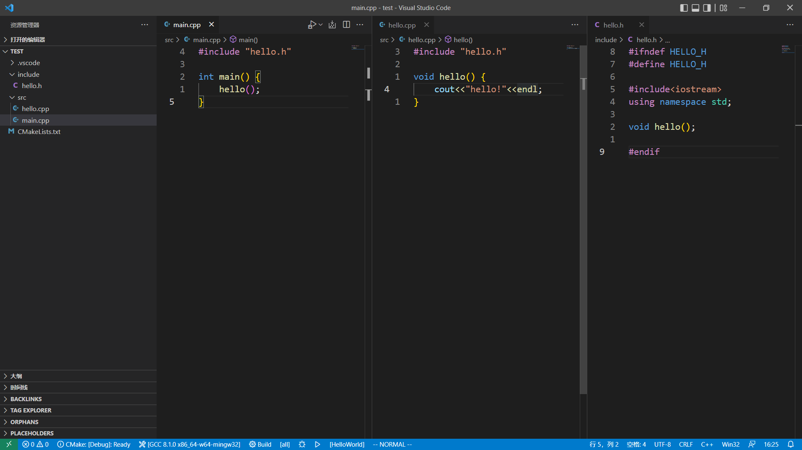

## 前言

之前在VS Code上配置了C++编译运行的环境，详见[[I-VSCode-C++]]，但是这只针对单文件，虽然能够通过修改设置达到编译多文件的目的，但支持不是很好，因此想使用CMake来编译构建项目。

> [[Z-CMake]]是生成makefile的工具，makefile是包含多条make命令的文件。

## 安装

### 安装CMake

下载地址：[https://cmake.org/download/](https://cmake.org/download/)

选择合适版本下载。

安装时选择加入系统环境变量，即`Add CMake to the system PATH for the current user`选项。

### 安装VS Code拓展

- CMake
- CMake Tools

正常安装完，打开一个cpp文件就能看到左下角状态栏中有CMake插件，如果没有，可以创建一个`CMakeLists.txt`文件激活，也可能是安装CMake时，添加到系统环境变量需要重启生效。

建议在设置中关闭`cmake.configureOnEdit`，该设置是在`CMakeLists.txt`保存时自动配置CMake项目目录，但是我VS Code开了自动保存文件，导致编辑过程中自动配置。

## 使用

创建一个简单的Hello World项目，在`main.cpp`中调用`hello.h`和`hello.cpp`定义的`hello`函数。


然后，我们来编写`CMakeLists.txt`文件：

```txt
#cmake verson，指定cmake版本 
cmake_minimum_required(VERSION 3.23)

#project name，指定项目的名称，一般和项目的文件夹名称对应
PROJECT(HelloWorld)

#head file path, 头文件目录
INCLUDE_DIRECTORIES(include)

#source directory，源文件目录，设置别名为DIR_SRC
AUX_SOURCE_DIRECTORY(src DIR_SRC)

#add executable file，添加要编译的可执行文件
ADD_EXECUTABLE(${PROJECT_NAME} ${DIR_SRC})
```

然后点击VS Code下方状态栏中的Build或快捷键`F7`，会生成一个`Build`目录，该目录下会有`Makefile`文件。

再点击下方三角形运行选项或快捷键`Shift+F5`，就能自动使用make编译文件并运行可执行文件。

更多CMake语法可以查看[[Z-CMake]]。