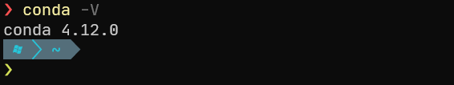
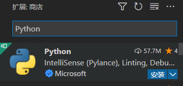
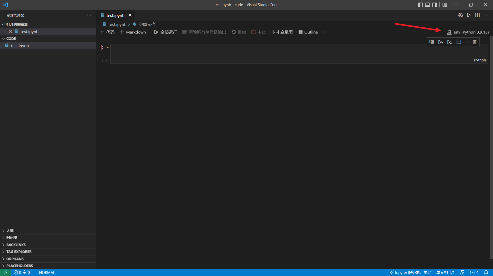
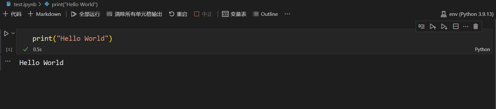

正常来说不涉及AI的Python代码编写，只需要在[Python官网](https://www.python.org/)中下载安装Python，在VS Code中安装Python插件，就能愉快地开发了。考虑到深度学习环境的复杂度，我还是选择了Anaconda来管理。

## 安装Anaconda

进入[Anaconda官网](https://www.anaconda.com/products/distribution)下载并安装，选择安装位置，并确定添加环境变量，耐心等待安装完成（可能比较久），应该没有什么困难。

在命令行输入`conda -V`可以查看是否安装成功。



如果提示无法识别指令的报错：

```shell
conda: The term 'conda' is not recognized as a name of a cmdlet, function, script file, or executable program.
Check the spelling of the name, or if a path was included, verify that the path is correct and try again.
```

是环境变量没有添加成功，需要手动将Anaconda安装目录下的Scripts目录加到环境变量PATH中。

## Conda指令

```shell
$conda list # 查看安装的组件
$conda update conda # 更新conda版本

# 创建一个叫做env的环境，使用3.9版本Python
$conda create --name env python=3.9 

$source activate env # 激活env环境(Linux 下)
$activate env # 激活env环境(Windows 下)
$source deactivate # 退出env环境(Linux 下)
$deactivate # 退出env环境(Windows 下)

$conda info -e  # 列出环境
$conda env list # 列出环境

$conda remove --name env --all # 删除环境
```

使用PowerShell激活conda可能会发现没有反应，明明`conda -V`能看到版本号。参考：

> https://www.cnblogs.com/dereen/p/ps_conda_env.html
> https://blog.csdn.net/weixin_42613703/article/details/112169956

执行`conda init powershell`，然后输入`conda activate env`来激活虚拟环境，**注意**这里`conda`以后不能省略。

同理，如果是VS Code中终端激活没反应，也可能是关联的终端没有配置好。

一般人到这里可能已经解决了，但我的问题是用了oh-my-posh美化终端时没有支持conda的样式，因此需要配置oh-my-posh，具体参见[[vscode_terminal#支持conda等环境]]。

## 安装组件

使用`conda search package_name`可以查看组件的可以安装版本，使用`conda install package_name`进行安装。

### 报错一

如果出现报错：

```shell
$conda install jupyter
Collecting package metadata (current_repodata.json): failed

CondaHTTPError: HTTP 000 CONNECTION FAILED for url <https://repo.anaconda.com/pkgs/main/win-64/current_repodata.json>
Elapsed: -

An HTTP error occurred when trying to retrieve this URL.
HTTP errors are often intermittent, and a simple retry will get you on your way.

If your current network has https://www.anaconda.com blocked, please file
a support request with your network engineering team.

'https://repo.anaconda.com/pkgs/main/win-64'
```

这里有几种解决方法：

**方法一**：

可能是网络问题导致，进行换源可以解决，以清华源为例

```shell
$conda config --add channels https://mirrors.tuna.tsinghua.edu.cn/anaconda/pkgs/free/
$conda config --add channels https://mirrors.tuna.tsinghua.edu.cn/anaconda/cloud/conda-forge 
$conda config --add channels https://mirrors.tuna.tsinghua.edu.cn/anaconda/cloud/msys2/

# 设置搜索时显示通道地址
$conda config --set show_channel_urls yes

#添加pytorch镜像
$conda config --add channels https://mirrors.tuna.tsinghua.edu.cn/anaconda/cloud/pytorch/
```

如果不行可以尝试使用http地址，也就是将s去掉，问题得到解决。

**方法二**：

关闭VPN，看别的博客中有许多人通过这一方法解决。
**方法三**:

重装Anaconda，没办法的办法。

### 报错二

安装到最后提示当前用户对Anaconda根目录没有写权限：

```shell
EnvironmentNotWritableError: The current user does not have write permissions to the target environment.
  environment location: C:\xxx\anaconda
```

在根目录下安装的需要使用管理员权限运行，可以安装在别的虚拟环境下。

## VS Code 配置

安装Python插件，包含绝大多数功能：



安装完之后我们创建一个`.ipynb`文件，自动激活插件。



安装插件后，整体功能都一目了然。右上角可以选择我们创建好的虚拟环境来执行。

输入代码`print("Hello World")`来测试是否能运行，其间提示需要安装ipykernel，安装完就可以正常运行了。



至此，VS Code的Anaconda环境就算是搭完了。