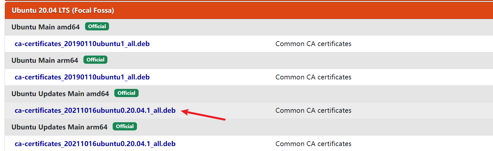
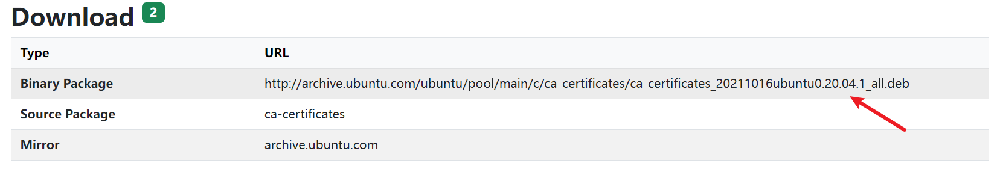

## 前置工作

需要先启动 Windows 上 WSL的相关服务：以管理员身份启动 PowerShell，输入以下命令：

```shell
# 开启 WSL 功能
dism.exe /online /enable-feature /featurename:Microsoft-Windows-Subsystem-Linux /all /norestart
# 开启 Hyper-V 功能
dism.exe /online /enable-feature /featurename:VirtualMachinePlatform /all /norestart
```

会提示设置重启生效，可以等下一步完成一起重启，接下来安装 Linux 的发行版本。

## 安装

可以在 Microsoft 商店选择喜欢的 Linux 版本，包括 Ubuntu、SUSE、Kali等，或是使用命令`wsl --install`就可完成，但一般默认装在 C 盘。

想装在其他盘可以使用下面的方法，以 Ubuntu 20.04 为例。

下载并安装 WSL 2 内核更新包：https://wslstorestorage.blob.core.windows.net/wslblob/wsl_update_x64.msi

选择或创建一个你喜欢的目录，例如`D:\Linux`，输入命令下载安装 Ubuntu 20.04。

```shell
Invoke-WebRequest -Uri https://wsldownload.azureedge.net/Ubuntu_2004.2020.424.0_x64.appx -OutFile Ubuntu20.04.appx -UseBasicParsing
```

可以看到`D:\Linux`目录下有一个`Ubuntu20.04.appx`，然后执行下面的命令：

```shell
Rename-Item .\Ubuntu20.04.appx Ubuntu.zip
Expand-Archive .\Ubuntu.zip -Verbose
```

此时 Ubuntu 20.04 就安装完成了，重启之后在命令行输入：

```shell
# 设置 WSL 2
wsl --set-default-version 2
```

双击`D:\Linux\Ubuntu`目录下的`ubuntu2004.exe`即可启动 Ubuntu，一开始会安装一些包和让你设置用户名密码。有问题可以先重启尝试解决。

第一次成功启动后，在微软的“终端”应用中已经可以新建 WSL 连接。

## 更换 apt 源

Ubuntu 使用 apt 安装应用，因为网络问题需要给 apt 换成国内的源，如阿里云源或清华源。

首先备份一下源文件，将`sources.list`拷贝一份`sources.list.bak`：

```shell
sudo cp /etc/apt/sources.list /etc/apt/sources.list.bak
```

然后打开`sources.list`文件进行修改，使用 vim 或 nano 等编辑器都可，这里使用 vim，按`i`进入编辑模式。

```shell
sudo vim /etc/apt/sources.list
```

打开之后添加源地址：

```text
#添加阿里源
deb http://mirrors.aliyun.com/ubuntu/ focal main restricted universe multiverse
deb-src http://mirrors.aliyun.com/ubuntu/ focal main restricted universe multiverse
deb http://mirrors.aliyun.com/ubuntu/ focal-security main restricted universe multiverse
deb-src http://mirrors.aliyun.com/ubuntu/ focal-security main restricted universe multiverse
deb http://mirrors.aliyun.com/ubuntu/ focal-updates main restricted universe multiverse
deb-src http://mirrors.aliyun.com/ubuntu/ focal-updates main restricted universe multiverse
deb http://mirrors.aliyun.com/ubuntu/ focal-proposed main restricted universe multiverse
deb-src http://mirrors.aliyun.com/ubuntu/ focal-proposed main restricted universe multiverse
deb http://mirrors.aliyun.com/ubuntu/ focal-backports main restricted universe multiverse
deb-src http://mirrors.aliyun.com/ubuntu/ focal-backports main restricted universe multiverse
#添加清华源
deb https://mirrors.tuna.tsinghua.edu.cn/ubuntu/ focal main restricted universe multiverse
# deb-src https://mirrors.tuna.tsinghua.edu.cn/ubuntu/ focal main restricted universe multiverse
deb https://mirrors.tuna.tsinghua.edu.cn/ubuntu/ focal-updates main restricted universe multiverse
# deb-src https://mirrors.tuna.tsinghua.edu.cn/ubuntu/ focal-updates main restricted universe multiverse
deb https://mirrors.tuna.tsinghua.edu.cn/ubuntu/ focal-backports main restricted universe multiverse
# deb-src https://mirrors.tuna.tsinghua.edu.cn/ubuntu/ focal-backports main restricted universe multiverse
deb https://mirrors.tuna.tsinghua.edu.cn/ubuntu/ focal-security main restricted universe multiverse
# deb-src https://mirrors.tuna.tsinghua.edu.cn/ubuntu/ focal-security main restricted universe multiverse multiverse
```

修改完保存退出，vim 按`Esc`退出编辑模式后，输入`:wq`保存退出，nano 使用`Ctrl+O`保存`Ctrl+X`退出。

换源后更新源：

```shell
sudo apt-get update
```

更新软件，显示我有 579 个可更新，还是花了一点时间，可以用到时再更新：

```shell
sudo apt-get upgrade
```

## 问题

WSL 安装怎么可能那么顺利，还是遇到一些问题。

### 更新源不成功

在给 apt 换源后更新源会报错，可能是`Failed to fetch`的报错，也可能是证书问题`Certificate verification failed`，需要使用对应的方法解决。

**Fetch 失败**：

一般是 DNS 服务器问题，默认 WSL 使用的本机连接 DNS 服务器，不行的话需要修改。

Ubuntu 的配置文件在`/etc/resolv.conf`（注意不是`resolve`），可以使用`cat /etc/resolv.conf`命令查看，文件头就写着“该文件自动生成，取消自动生成应该。。。”。为了我们的设置不在重启后被覆盖，就按他说的设置`/etc/wsl.conf`文件。

使用`vim`打开`/etc/wsl.conf`，在文件中添加：

```shell
[network]
generateResolvConf=false
```

注意是`...Resolv...`，保存关闭。

然后就可以设置`/etc/resolv.conf`文件了：

```shell
sudo vim /etc/resolv.conf
```

添加你想要的 DNS 服务器地址，例如：

```text
nameserver 8.8.8.8
```

也可以添加别的：阿里云`223.6.6.6`，`223.5.5.5`，腾讯`119.29.29.29`。

保存退出之后再使用更新源就行了，即使下次重启 WSL 之后配置也不会修改。

如果遇到无法保存的错误"Can't open linked file for writing"，此时`resolv.conf`是一个链接，尝试删除之后再用 vim 新建文件：

```shell
# 删除文件
sudo rm /etc/resolv.conf
# 再次编辑
sudo vim /etc/resolv.conf
```

> 参考：https://www.zhihu.com/question/421854017

**证书验证失败**：

1. `date`查看时间是否正确，排除时间造成的证书问题。
2. 通过`sudo apt install ca-certificates --reinstall`无法更新安装包。
3. 手动下载`ca-certificates.deb`文件重新安装最新版。

文件从[此处](https://link.juejin.cn/?target=https%3A%2F%2Fpkgs.org%2Fdownload%2Fca-certificates)下载，选择对应 Linux 版本，例如我是 Ubuntu 20.04 LTS (Focal Fossa)，选择一个最新版点击：



网页拉到下面有一个安装地址：



在 Ubuntu 终端我们进到`tmp`目录下载下来：

```shell
cd /tmp
wget http://archive.ubuntu.com/ubuntu/pool/main/c/ca-certificates/ca-certificates_20211016ubuntu0.20.04.1_all.deb
```

如果提示以下错误，可以先尝试配置 DNS 服务器，见上一条**Fetch 失败**的方法，然后使用`apt`安装：`sudo apt install ca-certificates --reinstall`

如果成功下载下来，使用`dpkg`命令安装：

```shell
dpkg -i ./ca-certificates_20211016ubuntu0.20.04.1_all.deb
```

再使用`sudo apt-get update`试试。

> 参考：https://juejin.cn/post/7033412379727626247